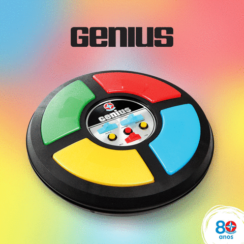

# Jogo Genius :mahjong:
Jogo de memória estilo o antigo brinquedo Genius.

Uma sequência de cores é indicada junto com sons e o jogador deve repetir a sequência na ordem correta. Acertando ele ganha um ponto e a sequência é incrementada em uma cor, caso erre o jogo é reiniciado.

O resultado pode ser visto [aqui](https://andreibuslik.github.io/Jogo-Genius/).

